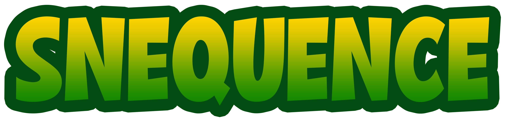

# Snequence !

Snequence is a mobile game developed in Unity for the subject CSC4027Z Game Design at UCT.

## Game Screenshots

## Building and running with Xcode simulator

It is reccommended to run the game using the IOS platform device in Unity, as opposed to the game engine one, as the game is designed to be manouvred with touch functionality. The snake won´t be able to be swiped if it is not run with a simulator engine.
Make sure you have the IOS platform downloaded in unity. This can be done from Unity Hub, under Installs.
After cloning the repo, open the game in Unity engine.
Open Build Settings (cmd shift B) and select IOS. Go to you project settings and select "other settings".
Underneath "target SDK", make sure Simulator SDK is selected. It should be already in the project settings from the pull.

After building, open the hierarchy in Xcode and select unity-iphone. Go to build settings and make sure the ENABLE_BITCODE field is set to 'NO'.

Snequence is then ready to build and run!
We reccommend using a simulator made after 2019, like the iphone 11. :)

## Game concept

Snequence is a combination of the classic games snake and color sequence. The objective of the game is to steer the snake around by swiping the screen to collect the colored orbs.
In order to advance in the game, the snake needs to eat the correct sequence of colors. This sequence is shown at the top of the screen.

### Power-ups and obstacles

**Heart**

Gives the snake an extra life to survive one bomb. 

**Bomb**

Explodes, killing the snake. This results in Game Over.

**Faster**

Makes the snake go faster for a short period of time.

**Slo-Mo**

Makes the snake go slower for a short period of time.

**Clock**

Adds ten seconds to the timer.

**Bush**

Hitting a bush will result in game over.

## Contributions

All group members contributed with developing the game in Unity.

Additionally:

**Karen Hompland:** Animations, logo design

**Ingrid Hagen:** Sound design

**Solveig Aune:** Game element design

Game elements are designed with Blender and texturized in Unity.

## Sound Effects
### Our sound effect are downloaded from Pixabay

**Sequence Complete**: short-success-sound-glockenspiel-treasure-video-game-6346.mp3

**Game over** : negative_beeps-6008.mp3

**Remove Heart** : glass-bottle-shatter-13847.mp3

**Add Heart** : cartoon_wink_magic_sparkle-6896.mp3

**Eat and click** : click-21156.mp3

**Bomb** : failure-drum-sound-effect-2-7184.mp3

### Our background music is downloaded from Jamendo

**Background Music** : Blue Jay Studio - Video Game Background 3

